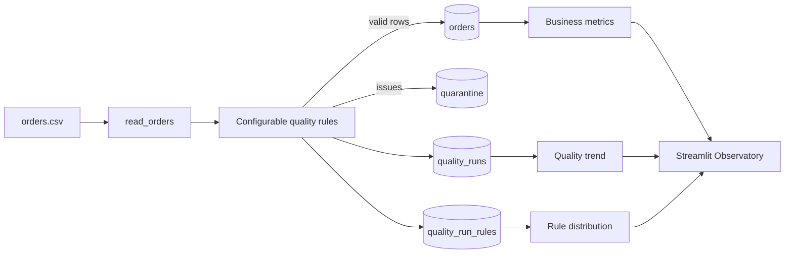

# Data Quality Observatory


**Data Quality Observatory** 是一个本地优先的数据质量观测平台。它把订单 CSV 作为输入，执行可配置规则校验，将可信记录与异常记录分流到 SQLite，并保留每次运行的质量快照，供 Streamlit 看板观察质量趋势、规则分布和业务指标。

## Data flow



## What it provides

- 可配置规则与阈值：`QualityConfig` / `RuleConfig`；不传配置时保持 Demo 的默认行为和现有 `check_quality(rows)`、`run_etl(csv, db)` API。
- 可信数据分流：有效行进入 `orders`，异常行进入 `quarantine`，记录来源文件、源行号和加载时间。
- 运行级观测：`quality_runs` 记录运行时间、总行、有效行、异常数、质量分数和 source；`quality_run_rules` 记录每次运行的规则分布。
- Streamlit 监控：运行历史、质量趋势、规则分布、异常下载、GMV/订单/客户/商品指标。

## Quality rules

| Rule | Default | Meaning |
| --- | --- | --- |
| `missing` | enabled | Required fields must be non-empty |
| `duplicate_primary_key` | enabled | `order_id` must be unique within a file |
| `invalid_date` | `%Y-%m-%d` | `order_date` must match the configured format |
| `invalid_number` | enabled | Quantity and unit price must parse as numbers |
| `non_positive` | `<= 0` | Quantity must be greater than the threshold |
| `negative_amount` | `< 0` | Quantity × price and price must not be below the threshold |

Example override:

```python
from quality import QualityConfig, RuleConfig, check_quality

policy = QualityConfig(rules={
    "invalid_date": RuleConfig(threshold="%d/%m/%Y"),
    "non_positive": {"enabled": False},
    "negative_amount": {"enabled": True, "threshold": -10},
})
summary = check_quality(rows, policy)
```

## Metric definitions

- **Valid rows**: rows with no emitted quality issue.
- **Issues**: rule violations, counted per violation rather than per row.
- **Quality score**: `max(0, 100 - issues / rows_checked * 100)`, rounded to one decimal. An empty input scores `0.0`.
- **GMV**: `SUM(quantity × unit_price)` over trusted `orders`.
- **AOV**: GMV divided by trusted order count.
- **Rule distribution**: summed issue counts by rule in `quality_run_rules`.

## Demo

The included `data/orders.csv` contains **10 synthetic, intentionally clean rows** for reproducible local demonstration. Its values are illustrative, not production data, and are not evidence of real business performance. Running the sample produces a 100.0 quality score and a `quality_runs` history record.

## Quick start

```powershell
python -m venv .venv
.\.venv\Scripts\Activate.ps1
pip install -r requirements.txt
python quality.py
pytest -q
streamlit run app.py
```

Open the local Streamlit URL, then use **Refresh pipeline** after changing the CSV. The pipeline is local-only and does not access a network service.

## SQL cookbook

`metrics.sql` includes queries for trusted business metrics, daily trends, run history, date-level quality trends, latest-run rule distribution, lineage, and quarantine analysis. Example:

```sql
SELECT run_at, total_rows, valid_rows, issue_count, score, source
FROM quality_runs ORDER BY run_at DESC;
```

## Tests

The test suite covers clean and invalid records, rule counts, quarantine behavior, repeatable ETL, configurable rule overrides, persisted run history, and rule distribution. Run it with `pytest -q`.

## Boundaries

This is a focused local observability project, not a production orchestrator. It currently handles CSV input and SQLite storage, uses a single-process Streamlit UI, and does not provide authentication, scheduling, schema evolution, distributed execution, or statistical anomaly detection. `create_schema` refreshes the current trusted snapshot while preserving historical quality runs.

## Repository layout

- `quality.py` - validation policy, scoring, ETL, and query APIs.
- `app.py` - Streamlit observatory.
- `metrics.sql` - reusable SQLite queries.
- `data/orders.csv` - synthetic demo input.
- `tests/` - regression and observability tests.

## Resume wording

> Built a local-first data quality observability platform in Python/SQLite: introduced configurable validation rules, quarantine and lineage handling, persisted pipeline-run snapshots, trend and rule-distribution queries, and a Streamlit monitoring dashboard with pytest coverage.
